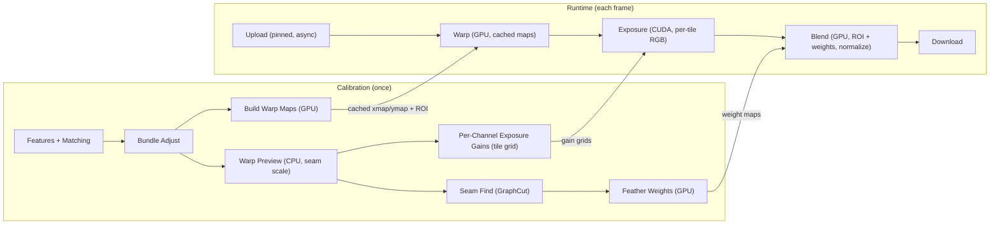

# OpenCV 2.4 — GPU‑Accelerated Real‑Time Image Stitching

This repository extends OpenCV 2.4 with a GPU‑optimized stitching pipeline centered around `cv::CachedStitcher`. Calibration (features, matching, bundle adjustment) is performed once; per‑frame composition runs on the GPU using cached warp maps, seam‑aware feather weights, per‑channel exposure compensation, and ROI‑based blending. A complete CPU fallback is available.

## Architecture

## Key Features (implemented)
- Cached transforms and ROI placement per image; panorama sized to exact extents.
- GPU warping via cached maps; no in‑place ops; multi‑stream capable.
- Seam‑aware feather weights built on GPU from seam masks.
- Per‑channel exposure compensation using a smoothed 32×32 tile grid (CUDA).
- ROI‑based blending with per‑pixel normalization; CPU fallback to OpenCV `Stitcher`.
- Optional pinned uploads; per‑stage timings (upload/warp/exposure/blend/download).

## Build
- Requirements: OpenCV 2.4 toolchain; CUDA Toolkit (for GPU); CMake ≥ 2.8.12.2; C++11 compiler.
- Configure:
  - `mkdir build && cd build`
  - `cmake .. -DCMAKE_BUILD_TYPE=Release -DWITH_CUDA=ON -DCACHED_STITCHER_BUILD_BENCHMARKS=ON`
  - `cmake --build . --parallel`
- Binaries:
  - `realtime_stitching` (runtime `--gpu/--no-gpu`)
  - `realtime_stitching_gpu`, `realtime_stitching_cpu` (defaults baked in)
  - `benchmark_stitching`, `benchmark_stitching_gpu`, `benchmark_stitching_cpu`

## Usage
- Images: `./realtime_stitching_gpu img1.jpg img2.jpg ...`
- Videos: `./realtime_stitching_gpu --video cam1.mp4 cam2.mp4`
- Webcams: `./realtime_stitching_gpu --camera 0 1`
- Benchmark: `./benchmark_stitching_gpu --iters 300 img1.jpg img2.jpg`
- Flags: `--bench` prints per‑stage timings; `--no-gpu` forces CPU path.

## Project Structure
- `include/CachedStitcher.hpp` public API, cache layout, performance stats.
- `src/CachedStitcher.cpp` calibration, ROI/weights/gains, GPU composition.
- `src/gpu_transform_cache.cu` CUDA kernels (warp, exposure, blending helpers).
- `examples/realtime_stitching.cpp` demo with optional bench output.
- `benchmarks/benchmark_stitching.cpp` headless timing tool.
- `CMakeLists_CachedStitcher.txt` library + binaries; CPU/GPU split executables.
- `modules/` OpenCV 2.4 sources (warpers, seam finder, blender, etc.).

## Notes
- Seam finding runs at seam scale via the OpenCV API; weights are then generated on GPU.
- Performance depends on content, resolution, GPU, and I/O. Use the benchmark tool to measure on your hardware.
