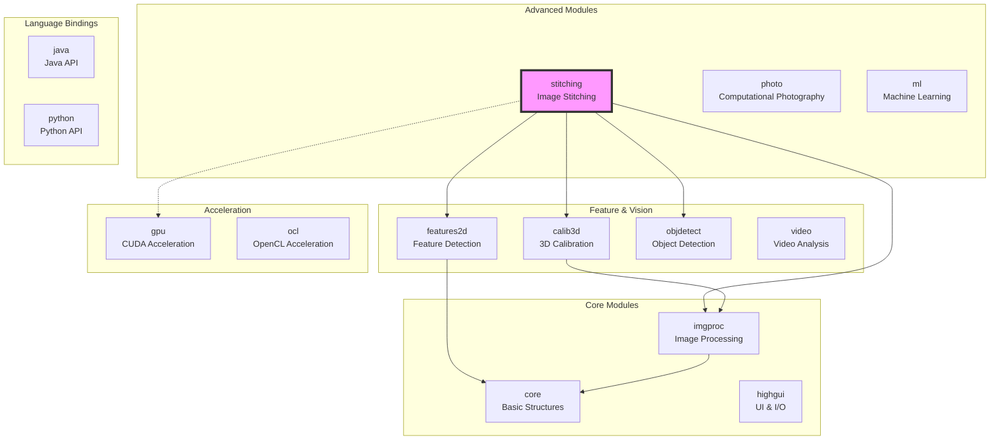
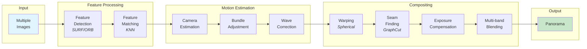
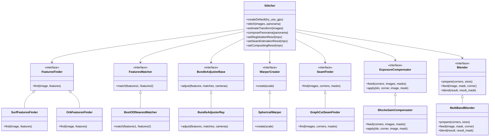
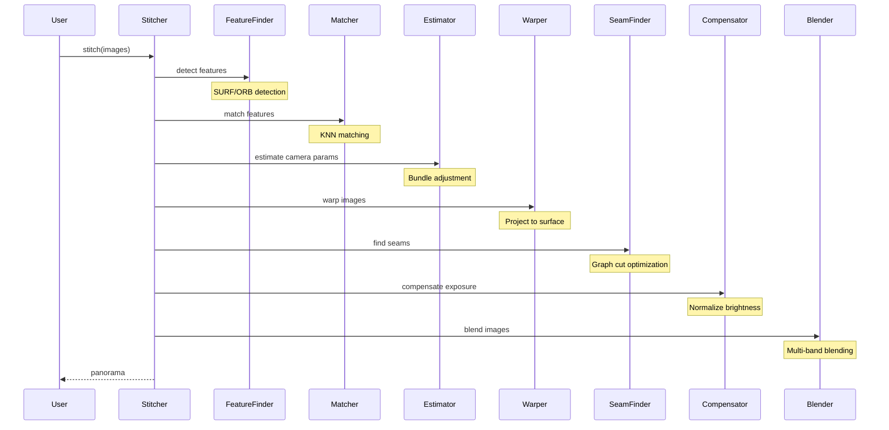

# OpenCV 2.4 - Image Stitching Library


## 📋 Table of Contents
- [Overview](#overview)
- [Architecture](#architecture)
- [Quick Start](#quick-start)
- [Installation](#installation)
- [Module Structure](#module-structure)
- [Stitching Pipeline](#stitching-pipeline)
- [Usage Examples](#usage-examples)
- [API Reference](#api-reference)
- [Advanced Configuration](#advanced-configuration)
- [Performance Optimization](#performance-optimization)
- [Testing](#testing)
- [Contributing](#contributing)
- [Resources](#resources)

## 🎯 Overview

OpenCV (Open Source Computer Vision Library) is a comprehensive computer vision and machine learning software library. This repository contains OpenCV 2.4.x with a focus on the **image stitching module**, which provides a complete pipeline for creating panoramic images from multiple photographs.

### Key Features
- ✨ **Complete Stitching Pipeline** - Feature detection, matching, motion estimation, warping, seam finding, exposure compensation, and blending
- 🚀 **GPU Acceleration** - CUDA and OpenCL support for performance-critical operations
- 🎨 **Multiple Projection Types** - Spherical, cylindrical, plane, fisheye, stereographic, and more
- 🔧 **Flexible Architecture** - Both high-level API for quick results and low-level components for customization
- 📱 **Cross-Platform** - Works on Linux, Windows, macOS, Android, and iOS

### Resources
- **Homepage**: <http://opencv.org>
- **Documentation**: <http://docs.opencv.org/2.4/>
- **Q&A Forum**: <http://answers.opencv.org>
- **Issue Tracking**: <https://github.com/opencv/opencv/issues>

## 🏗️ Architecture

### High-Level Module Architecture



### Stitching Pipeline Architecture



### Component Class Hierarchy



## 🚀 Quick Start

### Basic Usage

```cpp
#include <opencv2/stitching/stitcher.hpp>
#include <opencv2/highgui/highgui.hpp>
#include <vector>

int main() {
    // Load images
    std::vector<cv::Mat> images;
    images.push_back(cv::imread("img1.jpg"));
    images.push_back(cv::imread("img2.jpg"));
    images.push_back(cv::imread("img3.jpg"));

    // Create stitcher with default parameters
    cv::Stitcher stitcher = cv::Stitcher::createDefault(false);

    // Stitch images
    cv::Mat panorama;
    cv::Stitcher::Status status = stitcher.stitch(images, panorama);

    if (status == cv::Stitcher::OK) {
        cv::imwrite("panorama.jpg", panorama);
        return 0;
    } else {
        std::cerr << "Stitching failed!" << std::endl;
        return 1;
    }
}
```

### Command Line Usage

```bash
# Simple stitching
./stitching img1.jpg img2.jpg img3.jpg --output panorama.jpg

# With GPU acceleration
./stitching img1.jpg img2.jpg img3.jpg --try_gpu yes --output panorama.jpg

# Detailed control
./stitching_detailed img1.jpg img2.jpg img3.jpg \
    --features surf \
    --matcher homography \
    --estimator homography \
    --match_conf 0.65 \
    --ba ray \
    --ba_refine_mask xxxxx \
    --wave_correct horiz \
    --warp spherical \
    --seam gc_color \
    --compose_megapix 3 \
    --expos_comp blocks \
    --blend multiband \
    --blend_strength 5 \
    --output panorama.jpg
```

## 📦 Installation

### Prerequisites

- C++ compiler with C++11 support
- CMake 2.8.12.2 or higher
- Optional: CUDA toolkit for GPU support
- Optional: Python 2.7+ for Python bindings

### Building from Source

```bash
# Clone the repository
git clone https://github.com/opencv/opencv.git -b 2.4
cd opencv

# Create build directory
mkdir build && cd build

# Configure with CMake
cmake .. \
    -DCMAKE_BUILD_TYPE=Release \
    -DBUILD_opencv_stitching=ON \
    -DWITH_CUDA=ON \              # Optional: Enable CUDA
    -DWITH_TBB=ON \               # Optional: Enable TBB
    -DBUILD_EXAMPLES=ON \         # Build samples
    -DBUILD_TESTS=ON              # Build tests

# Build (use -j flag for parallel compilation)
make -j$(nproc)

# Install (optional)
sudo make install

# Run tests (optional)
make test
```

### Platform-Specific Instructions

#### Ubuntu/Debian
```bash
# Install dependencies
sudo apt-get update
sudo apt-get install build-essential cmake git pkg-config
sudo apt-get install libjpeg-dev libtiff-dev libpng-dev
sudo apt-get install libavcodec-dev libavformat-dev libswscale-dev
sudo apt-get install libgtk2.0-dev
sudo apt-get install python-dev python-numpy
sudo apt-get install libtbb2 libtbb-dev
```

#### macOS
```bash
# Using Homebrew
brew install cmake pkg-config
brew install jpeg libpng libtiff
brew install eigen tbb
```

#### Windows
Use CMake GUI to configure and generate Visual Studio project files, then build using Visual Studio.

## 📁 Module Structure

```
opencv/
├── modules/
│   ├── core/              # Basic structures and algorithms
│   ├── imgproc/           # Image processing functions
│   ├── highgui/           # UI and I/O
│   ├── features2d/        # Feature detection/description
│   ├── calib3d/           # Camera calibration
│   ├── objdetect/         # Object detection
│   ├── stitching/         # IMAGE STITCHING MODULE
│   │   ├── include/       # Public headers
│   │   ├── src/           # Implementation (5,406 lines)
│   │   ├── test/          # Unit tests
│   │   ├── perf/          # Performance tests
│   │   └── doc/           # Documentation
│   ├── gpu/               # CUDA acceleration
│   ├── ocl/               # OpenCL acceleration
│   └── ...                # Other modules
├── samples/
│   └── cpp/
│       ├── stitching.cpp           # Simple example
│       └── stitching_detailed.cpp  # Advanced example
├── doc/                   # Documentation
└── CMakeLists.txt        # Build configuration
```

## 🔄 Stitching Pipeline

### Pipeline Stages



### Detailed Pipeline Components

#### 1. Feature Detection & Matching
- **SURF** (Scale-Invariant Feature Transform) - Default if available
- **ORB** (Oriented FAST and Rotated BRIEF) - Free alternative
- **Best-of-2 Nearest Neighbor** matching with confidence threshold

#### 2. Motion Estimation
- **Homography estimation** for initial camera parameters
- **Bundle adjustment** for global optimization
- **Wave correction** to reduce vertical/horizontal drift

#### 3. Image Warping
- **Plane** - Simple planar projection
- **Cylindrical** - Good for horizontal panoramas
- **Spherical** - Best for wide field of view (default)
- **Fisheye** - Ultra-wide angle
- **Stereographic** - Conformal projection
- **Mercator** - Map-like projection

#### 4. Seam Finding
- **No seam** - Direct placement
- **Voronoi** - Based on Voronoi cells
- **Graph cut** - Energy minimization (default)
- **Dynamic programming** - Optimal path finding

#### 5. Exposure Compensation
- **No compensation** - Keep original exposure
- **Gain compensation** - Simple gain adjustment
- **Block gain** - Block-based adjustment (default)

#### 6. Image Blending
- **No blending** - Simple placement
- **Feather blending** - Linear transition
- **Multi-band blending** - Laplacian pyramid (default)

## 💻 Usage Examples

### Example 1: Simple Panorama

```cpp
#include <opencv2/stitching/stitcher.hpp>
#include <opencv2/highgui/highgui.hpp>
#include <iostream>
#include <vector>

int main(int argc, char* argv[]) {
    // Check arguments
    if (argc < 3) {
        std::cout << "Usage: " << argv[0] << " <img1> <img2> [img3...]" << std::endl;
        return -1;
    }

    // Load images
    std::vector<cv::Mat> images;
    for (int i = 1; i < argc; ++i) {
        cv::Mat img = cv::imread(argv[i]);
        if (img.empty()) {
            std::cerr << "Can't read image '" << argv[i] << "'" << std::endl;
            return -1;
        }
        images.push_back(img);
    }

    // Create default stitcher
    cv::Stitcher stitcher = cv::Stitcher::createDefault(false);

    // Stitch images
    cv::Mat panorama;
    cv::Stitcher::Status status = stitcher.stitch(images, panorama);

    // Check result
    if (status != cv::Stitcher::OK) {
        std::cerr << "Can't stitch images, error code = " << int(status) << std::endl;
        return -1;
    }

    // Save result
    cv::imwrite("result.jpg", panorama);
    std::cout << "Panorama saved to 'result.jpg'" << std::endl;

    return 0;
}
```

### Example 2: Custom Configuration

```cpp
#include <opencv2/stitching/stitcher.hpp>
#include <opencv2/stitching/detail/matchers.hpp>
#include <opencv2/stitching/detail/motion_estimators.hpp>
#include <opencv2/stitching/detail/seam_finders.hpp>
#include <opencv2/stitching/detail/blenders.hpp>

int main() {
    std::vector<cv::Mat> images;
    // ... load images ...

    // Create and configure stitcher
    cv::Stitcher stitcher = cv::Stitcher::createDefault(false);

    // Set registration resolution (0.6 Mpx default)
    stitcher.setRegistrationResol(0.8);

    // Set seam estimation resolution (0.1 Mpx default)
    stitcher.setSeamEstimationResol(0.2);

    // Set compositing resolution (-1 = original resolution)
    stitcher.setCompositingResol(-1);

    // Configure confidence threshold
    stitcher.setPanoConfidenceThresh(0.9);

    // Enable wave correction
    stitcher.setWaveCorrection(true);
    stitcher.setWaveCorrectKind(cv::detail::WAVE_CORRECT_HORIZ);

    // Use cylindrical projection instead of spherical
    stitcher.setWarper(new cv::CylindricalWarper());

    // Use graph cut seam finder with color mode
    cv::Ptr<cv::detail::GraphCutSeamFinder> seam_finder =
        new cv::detail::GraphCutSeamFinder(cv::detail::GraphCutSeamFinderBase::COST_COLOR);
    stitcher.setSeamFinder(seam_finder);

    // Stitch images
    cv::Mat panorama;
    cv::Stitcher::Status status = stitcher.stitch(images, panorama);

    if (status == cv::Stitcher::OK) {
        cv::imwrite("custom_panorama.jpg", panorama);
    }

    return 0;
}
```

### Example 3: Two-Phase Stitching

```cpp
#include <opencv2/stitching/stitcher.hpp>

int main() {
    std::vector<cv::Mat> images;
    // ... load images ...

    cv::Stitcher stitcher = cv::Stitcher::createDefault(false);

    // Phase 1: Estimate camera parameters
    cv::Stitcher::Status status = stitcher.estimateTransform(images);
    if (status != cv::Stitcher::OK) {
        std::cerr << "Failed to estimate transform" << std::endl;
        return -1;
    }

    // At this point, you can:
    // - Get camera parameters
    // - Modify warping settings
    // - Change compositing parameters

    // Phase 2: Compose the panorama
    cv::Mat panorama;
    status = stitcher.composePanorama(panorama);
    if (status != cv::Stitcher::OK) {
        std::cerr << "Failed to compose panorama" << std::endl;
        return -1;
    }

    cv::imwrite("two_phase_result.jpg", panorama);

    // You can also compose with different images
    std::vector<cv::Mat> other_images;
    // ... load different images with same camera positions ...
    cv::Mat hdr_panorama;
    status = stitcher.composePanorama(other_images, hdr_panorama);

    return 0;
}
```

### Example 4: GPU Acceleration

```cpp
#include <opencv2/stitching/stitcher.hpp>
#include <opencv2/gpu/gpu.hpp>

int main() {
    // Check GPU availability
    int gpu_count = cv::gpu::getCudaEnabledDeviceCount();
    if (gpu_count == 0) {
        std::cerr << "No GPU found, falling back to CPU" << std::endl;
    }

    std::vector<cv::Mat> images;
    // ... load images ...

    // Create stitcher with GPU support
    bool try_use_gpu = gpu_count > 0;
    cv::Stitcher stitcher = cv::Stitcher::createDefault(try_use_gpu);

    // GPU will be used for:
    // - Feature detection (SURF)
    // - Seam finding
    // - Image warping

    cv::Mat panorama;
    cv::Stitcher::Status status = stitcher.stitch(images, panorama);

    if (status == cv::Stitcher::OK) {
        cv::imwrite("gpu_panorama.jpg", panorama);
    }

    return 0;
}
```

## 📚 API Reference

### Main Classes

#### cv::Stitcher

The high-level stitching API class.

```cpp
class Stitcher {
public:
    enum Status {
        OK,                  // Stitching successful
        ERR_NEED_MORE_IMGS  // Need more images
    };

    // Factory method
    static Stitcher createDefault(bool try_use_gpu = false);

    // Single-call stitching
    Status stitch(InputArray images, OutputArray pano);

    // Two-phase stitching
    Status estimateTransform(InputArray images);
    Status composePanorama(OutputArray pano);
    Status composePanorama(InputArray images, OutputArray pano);

    // Configuration methods
    void setRegistrationResol(double resol_mpx);
    void setSeamEstimationResol(double resol_mpx);
    void setCompositingResol(double resol_mpx);
    void setPanoConfidenceThresh(double conf_thresh);
    void setWaveCorrection(bool flag);
    void setWaveCorrectKind(detail::WaveCorrectKind kind);

    // Component setters
    void setFeaturesFinder(Ptr<detail::FeaturesFinder> features_finder);
    void setFeaturesMatcher(Ptr<detail::FeaturesMatcher> features_matcher);
    void setBundleAdjuster(Ptr<detail::BundleAdjusterBase> bundle_adjuster);
    void setWarper(Ptr<WarperCreator> creator);
    void setSeamFinder(Ptr<detail::SeamFinder> seam_finder);
    void setExposureCompensator(Ptr<detail::ExposureCompensator> exposure_comp);
    void setBlender(Ptr<detail::Blender> b);
};
```

### detail Namespace Classes

#### Feature Detection

```cpp
namespace detail {
    class FeaturesFinder {
        virtual void find(const Mat &image, ImageFeatures &features) = 0;
    };

    class SurfFeaturesFinder : public FeaturesFinder {
        SurfFeaturesFinder(double hess_thresh = 300.,
                          int num_octaves = 3,
                          int num_layers = 4);
    };

    class OrbFeaturesFinder : public FeaturesFinder {
        OrbFeaturesFinder(Size grid_size = Size(3, 1),
                         int nfeatures = 1500,
                         float scaleFactor = 1.3f,
                         int nlevels = 5);
    };

    struct ImageFeatures {
        int img_idx;
        Size img_size;
        std::vector<KeyPoint> keypoints;
        Mat descriptors;
    };

    struct MatchesInfo {
        int src_img_idx, dst_img_idx;
        std::vector<DMatch> matches;
        std::vector<uchar> inliers_mask;
        int num_inliers;
        Mat H;  // Homography
        double confidence;
    };
}
```

#### Motion Estimation

```cpp
namespace detail {
    class Estimator {
        virtual bool operator()(const std::vector<ImageFeatures> &features,
                               const std::vector<MatchesInfo> &pairwise_matches,
                               std::vector<CameraParams> &cameras) = 0;
    };

    class HomographyBasedEstimator : public Estimator {
        HomographyBasedEstimator(bool is_focals_estimated = false);
    };

    class BundleAdjusterBase : public Estimator {
        virtual void setConfThresh(double conf_thresh);
        virtual void setRefinementMask(const Mat &mask);
        virtual void setTermCriteria(const TermCriteria& term_criteria);
    };

    class BundleAdjusterRay : public BundleAdjusterBase {};
    class BundleAdjusterReproj : public BundleAdjusterBase {};

    struct CameraParams {
        float focal;
        Mat R;  // Rotation matrix
        Mat t;  // Translation vector
        Mat K() const;  // Intrinsics matrix
    };
}
```

#### Warping

```cpp
class WarperCreator {
    virtual Ptr<detail::RotationWarper> create(float scale) const = 0;
};

class PlaneWarper : public WarperCreator {};
class CylindricalWarper : public WarperCreator {};
class SphericalWarper : public WarperCreator {};
class FisheyeWarper : public WarperCreator {};
class StereographicWarper : public WarperCreator {};
class MercatorWarper : public WarperCreator {};
```

#### Seam Finding

```cpp
namespace detail {
    class SeamFinder {
        virtual void find(const std::vector<Mat> &src,
                         const std::vector<Point> &corners,
                         std::vector<Mat> &masks) = 0;
    };

    class NoSeamFinder : public SeamFinder {};
    class VoronoiSeamFinder : public SeamFinder {};
    class DpSeamFinder : public SeamFinder {};

    class GraphCutSeamFinderBase {
        enum CostType {
            COST_COLOR,
            COST_COLOR_GRAD
        };
    };

    class GraphCutSeamFinder : public GraphCutSeamFinderBase,
                               public SeamFinder {
        GraphCutSeamFinder(CostType cost_type = COST_COLOR_GRAD,
                          float terminal_cost = 10000.f,
                          float bad_region_penalty = 1000.f);
    };
}
```

#### Exposure Compensation

```cpp
namespace detail {
    class ExposureCompensator {
        virtual void feed(const std::vector<Point> &corners,
                         const std::vector<Mat> &images,
                         const std::vector<Mat> &masks) = 0;
        virtual void apply(int index, Point corner,
                          Mat &image, const Mat &mask) = 0;
    };

    class NoExposureCompensator : public ExposureCompensator {};
    class GainCompensator : public ExposureCompensator {};
    class BlocksGainCompensator : public GainCompensator {
        BlocksGainCompensator(int bl_width = 32, int bl_height = 32);
    };
}
```

#### Blending

```cpp
namespace detail {
    class Blender {
        virtual void prepare(const std::vector<Point> &corners,
                           const std::vector<Size> &sizes) = 0;
        virtual void feed(const Mat &img, const Mat &mask,
                         Point tl) = 0;
        virtual void blend(Mat &dst, Mat &dst_mask) = 0;
    };

    class FeatherBlender : public Blender {
        FeatherBlender(float sharpness = 0.02f);
    };

    class MultiBandBlender : public Blender {
        MultiBandBlender(int num_bands = 5);
        void setNumBands(int num_bands);
    };
}
```

## ⚙️ Advanced Configuration

### Resolution Parameters

```cpp
// Registration resolution in megapixels
// Lower = faster, higher = more accurate
stitcher.setRegistrationResol(0.6);  // Default

// Seam estimation resolution
// Lower = faster seam finding
stitcher.setSeamEstimationResol(0.1);  // Default

// Compositing resolution
// -1 = use original, >0 = scale to megapixels
stitcher.setCompositingResol(-1);  // Default
```

### Confidence Threshold

```cpp
// Minimum confidence for image matching
// Higher = stricter matching
stitcher.setPanoConfidenceThresh(1.0);  // Default
```

### Wave Correction

```cpp
// Correct for camera rotation errors
stitcher.setWaveCorrection(true);

// Correction direction
stitcher.setWaveCorrectKind(detail::WAVE_CORRECT_HORIZ);  // or WAVE_CORRECT_VERT
```

### Custom Pipeline Components

```cpp
// Use SURF features with custom parameters
Ptr<detail::SurfFeaturesFinder> finder =
    new detail::SurfFeaturesFinder(300, 4, 4);
stitcher.setFeaturesFinder(finder);

// Use custom matching confidence
Ptr<detail::BestOf2NearestMatcher> matcher =
    new detail::BestOf2NearestMatcher(false, 0.65f);
stitcher.setFeaturesMatcher(matcher);

// Use reprojection error bundle adjustment
stitcher.setBundleAdjuster(new detail::BundleAdjusterReproj());

// Use cylindrical projection
stitcher.setWarper(new CylindricalWarper());

// Use Voronoi seam finder for speed
stitcher.setSeamFinder(new detail::VoronoiSeamFinder());

// Disable exposure compensation for speed
stitcher.setExposureCompensator(new detail::NoExposureCompensator());

// Use feather blending for speed
stitcher.setBlender(new detail::FeatherBlender(0.02f));
```

## 🚀 Performance Optimization

### GPU Acceleration

Enable GPU support for significant speedups:

```cpp
// Check GPU availability
if (cv::gpu::getCudaEnabledDeviceCount() > 0) {
    cv::Stitcher stitcher = cv::Stitcher::createDefault(true);
    // GPU will be used for:
    // - SURF feature detection
    // - Graph cut seam finding
    // - Image warping operations
}
```

### Performance Tuning

#### 1. Reduce Resolution
```cpp
// Lower resolution for faster processing
stitcher.setRegistrationResol(0.3);   // Half default
stitcher.setSeamEstimationResol(0.05); // Half default
stitcher.setCompositingResol(1.0);     // 1 Mpx output
```

#### 2. Use Faster Algorithms
```cpp
// ORB instead of SURF (no patent issues, faster)
stitcher.setFeaturesFinder(new detail::OrbFeaturesFinder());

// Voronoi instead of GraphCut seams
stitcher.setSeamFinder(new detail::VoronoiSeamFinder());

// No exposure compensation
stitcher.setExposureCompensator(new detail::NoExposureCompensator());

// Feather blending instead of multiband
stitcher.setBlender(new detail::FeatherBlender());
```

#### 3. Parallel Processing
```cpp
// Enable TBB for parallel processing
// Set during CMake configuration:
// cmake -DWITH_TBB=ON ..

// Or use OpenMP
// cmake -DWITH_OPENMP=ON ..
```

### Memory Optimization

```cpp
// Process images in batches for large datasets
std::vector<cv::Mat> batch;
for (size_t i = 0; i < all_images.size(); i += 10) {
    batch.clear();
    for (size_t j = i; j < std::min(i + 10, all_images.size()); ++j) {
        batch.push_back(all_images[j]);
    }
    // Process batch
}

// Release intermediate results
stitcher.estimateTransform(images);
images.clear();  // Free memory
stitcher.composePanorama(panorama);
```

## 🧪 Testing

### Running Tests

```bash
# Build with tests enabled
cmake -DBUILD_TESTS=ON ..
make

# Run all tests
make test

# Run stitching module tests
./bin/opencv_test_stitching

# Run specific test
./bin/opencv_test_stitching --gtest_filter=Stitcher*

# Run performance tests
./bin/opencv_perf_stitching
```

### Writing Custom Tests

```cpp
#include <opencv2/ts/ts.hpp>
#include <opencv2/stitching/stitcher.hpp>

TEST(Stitching, BasicPanorama) {
    // Load test images
    std::vector<cv::Mat> images;
    images.push_back(cv::imread("test1.jpg"));
    images.push_back(cv::imread("test2.jpg"));

    // Create stitcher
    cv::Stitcher stitcher = cv::Stitcher::createDefault(false);

    // Test stitching
    cv::Mat pano;
    cv::Stitcher::Status status = stitcher.stitch(images, pano);

    // Verify results
    EXPECT_EQ(cv::Stitcher::OK, status);
    EXPECT_FALSE(pano.empty());
    EXPECT_GT(pano.cols, images[0].cols);
}
```

## 🤝 Contributing

### Guidelines

Please read the [contribution guide](https://github.com/opencv/opencv/wiki/How_to_contribute) before starting work on a pull request.

Summary of guidelines:
- One pull request per issue
- Choose the right base branch (2.4 for this version)
- Include tests and documentation
- Clean up commits before submitting
- Follow the coding style guide

### Development Workflow

1. Fork the repository
2. Create a feature branch
```bash
git checkout -b feature/my-feature
```
3. Make changes and commit
```bash
git add .
git commit -m "Add my feature"
```
4. Run tests
```bash
make test
```
5. Push and create pull request
```bash
git push origin feature/my-feature
```

## 📖 Resources

### Documentation
- [OpenCV 2.4 Documentation](http://docs.opencv.org/2.4/)
- [Stitching Module Tutorial](http://docs.opencv.org/2.4/modules/stitching/doc/introduction.html)
- [Q&A Forum](http://answers.opencv.org)

### Academic References
- **[BL07]** M. Brown and D. Lowe. "Automatic Panoramic Image Stitching using Invariant Features", IJCV 2007
- **[RS10]** R. Szeliski. "Computer Vision: Algorithms and Applications", Springer 2010
- **[RS04]** R. Szeliski. "Image Alignment and Stitching: A Tutorial", MSR-TR-2004-92
- **[SS00]** H. Shum and R. Szeliski. "Construction of Panoramic Mosaics with Global and Local Alignment", IJCV 2000

### Sample Projects
- `samples/cpp/stitching.cpp` - Basic stitching example
- `samples/cpp/stitching_detailed.cpp` - Advanced configuration example

### Community
- [OpenCV GitHub](https://github.com/opencv/opencv)
- [Stack Overflow OpenCV Tag](https://stackoverflow.com/questions/tagged/opencv)
- [OpenCV Forum](https://forum.opencv.org/)

## 📄 License

This project is licensed under the BSD 3-Clause License. See the LICENSE file for details.

---

**Note**: This is OpenCV 2.4.x, which is a legacy version. For new projects, consider using OpenCV 4.x which has improved performance and additional features. However, OpenCV 2.4 remains widely used and is stable for production panorama stitching applications.